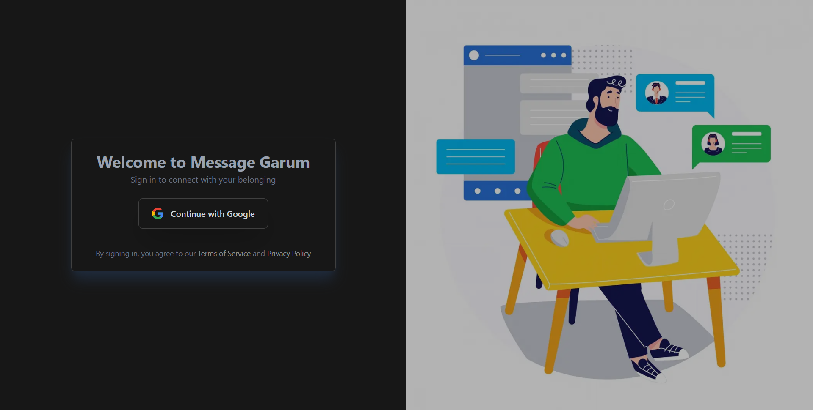
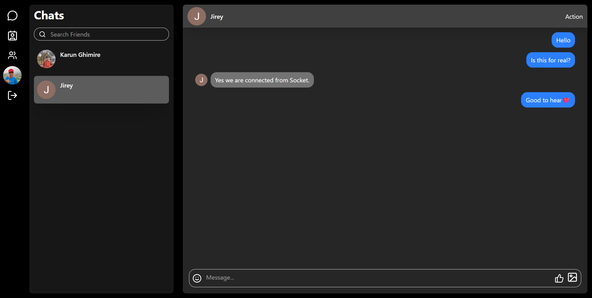
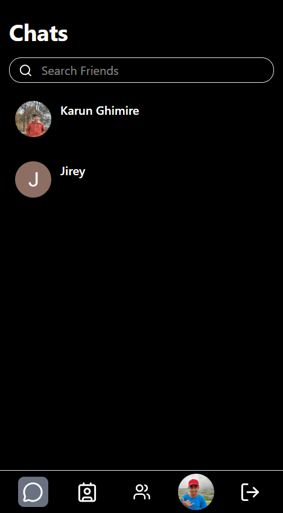

# 🚀 Real-Time Chat Application

A fast, modern, and scalable **real-time chat app** built with **Next.js, Socket.io, and Neon PostgreSQL**, deployed on **Render**.

This project demonstrates full-stack development skills including authentication, real-time communication, database design, and production deployment.

---

## 🌐 Live Demo

👉 https://next-chat-4m44.onrender.com/

---

## 📸 Screenshots

### 🔐 Login Page

### 💬 Chat Interface

### 📱 Mobile View

---

## ✨ Features

- ⚡ Real-time messaging using Socket.io
- 🚀 Instant message delivery (no refresh needed)
- 👥 Group chats
- 🖼 Image sharing
- 🔐 User authentication
- 📱 Responsive UI (mobile friendly)
- 🗄 Persistent message storage with PostgreSQL
- ⚙️ Server-side rendering with Next.js
- 🌍 Production deployment on Render

---

## 🛠 Tech Stack

### Frontend
- Next.js (App Router)
- React
- Tailwind CSS

### Backend
- Next.js API Routes
- Socket.io (WebSockets)

### Database
- Neon PostgreSQL

### Deployment
- Render

---

### 🔥 Key Learnings

- Real-time communication with WebSockets

- Managing sockets inside Next.js

- Server-side authentication

- PostgreSQL schema design

- Handling production environment configs

- Deploying full-stack apps to Render

### 🚀 Future Improvements

- Message read receipts

- Typing indicators

- Notifications

- Redis for scaling sockets

## 👨‍💻 Author

**Karun Ghimire**  
Web Developer | BCA Student  
Kathmandu, Nepal  

🔗 GitHub: https://github.com/KarunJr